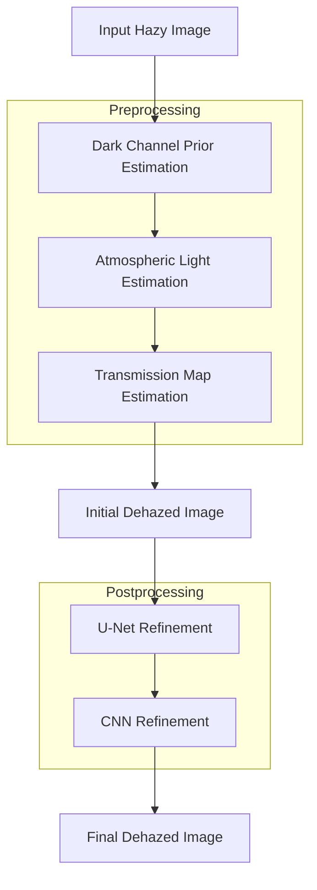

# Image Dehazing using DCP-CNN

## Architecture Diagram

Below is the flowchart representing the architecture of the DCP-CNN image dehazing pipeline:



---

_This diagram visually summarizes the main steps in the pipeline, from input to final dehazed output, highlighting both preprocessing and postprocessing stages._
# Image Dehazing using DCP and CNN/UNet

This project implements an image dehazing pipeline using the Dark Channel Prior (DCP) method, with deep learning-based refinement using CNN and UNet architectures. The pipeline removes haze from images by estimating the transmission map and atmospheric light, then refines the transmission map using neural networks for improved results.

## Project Structure

- main.py — (empty or entry point placeholder)
- train_unet.py — Script to train a UNet model for transmission map refinement using synthetic hazy images.
- test_dark_channel.py — Runs the full dehazing pipeline on a sample image, saving intermediate and final results.
- requirements.txt — Python dependencies.
- unet_weights.pth — Trained weights for the UNet model.
- dataset/
  - clean/ — Folder for clean (haze-free) images (used for training).
  - hazy/ — Folder for hazy images (used for testing/inference).
- models/
  - unet.py — UNet model definition for transmission map refinement.
  - cnn_refinement.py — CNN model for transmission map refinement (alternative to UNet).
- utils/
  - dark_channel.py — Computes the dark channel prior of an image.
  - atmospheric_light.py — Estimates atmospheric light from the image and dark channel.
  - transmission.py — Estimates the transmission map.
  - dehaze.py — Recovers the dehazed image using the atmospheric model.
  - cnn_refine.py — Refines the transmission map using the CNN model.
  - unet_refine.py — Refines the transmission map using the UNet model.
- outputs/ — Stores output images from the pipeline (created during testing/inference).

## Installation

1. Clone the repository and navigate to the project folder.
2. (Recommended) Create and activate a Python virtual environment:
   ```bash
   python -m venv venv
   # On Windows:
   venv\Scripts\activate
   # On Unix/Mac:
   source venv/bin/activate
   ```
3. Install dependencies:
   ```bash
   pip install -r requirements.txt
   ```

## Usage

### 1. Training the UNet Model

To train the UNet for transmission map refinement using synthetic hazy images generated from clean images:

```bash
python train_unet.py
```
- Clean images should be placed in `dataset/clean/`.
- The script will generate synthetic haze, train the UNet, and save weights to `unet_weights.pth`.

### 2. Running the Dehazing Pipeline

To run the full dehazing pipeline on a sample hazy image:

```bash
python test_dark_channel.py
```
- The script loads a hazy image from `dataset/hazy/hazy_img1.jpg` (modify as needed).
- It computes the dark channel, estimates atmospheric light and transmission, refines the transmission map using UNet, and recovers the dehazed image.
- Intermediate and final results are saved in the `outputs/` directory:
  - input.png — Original hazy input
  - dark_channel.png — Dark channel map
  - transmission.png — Initial transmission map
  - refined_transmission.png — Refined transmission map
  - dehazed.png — Final dehazed image
  - comparison.png — Side-by-side comparison of all steps

## Core Methods

- **Dark Channel Prior**: Used to estimate haze thickness in the image.
- **Atmospheric Light Estimation**: Finds the brightest pixels in the dark channel to estimate the global atmospheric light.
- **Transmission Map Estimation**: Estimates how much light is transmitted at each pixel.
- **Transmission Refinement**: Uses a trained UNet (or CNN) to refine the coarse transmission map.
- **Image Recovery**: Recovers the haze-free image using the atmospheric scattering model.

## Requirements

- Python 3.8+
- PyTorch
- OpenCV
- NumPy
- tqdm

See `requirements.txt` for exact versions.

## Notes
- The pipeline is modular; you can swap the refinement model (UNet or CNN) by changing the import in the refinement utility.
- The `outputs/` and `dataset/` folders are ignored by git (see `.gitignore`).
- For best results, use high-quality clean images for training.

## References
- He, Kaiming, et al. "Single image haze removal using dark channel prior." IEEE Transactions on Pattern Analysis and Machine Intelligence, 2011.
- UNet: Ronneberger, Olaf, et al. "U-Net: Convolutional Networks for Biomedical Image Segmentation." MICCAI 2015.

---

Feel free to modify the scripts for your own datasets or to experiment with different refinement networks.
